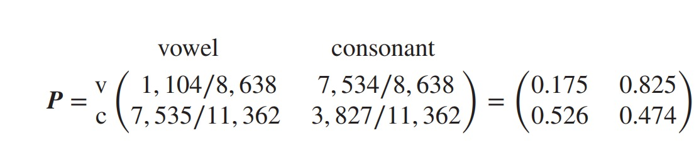
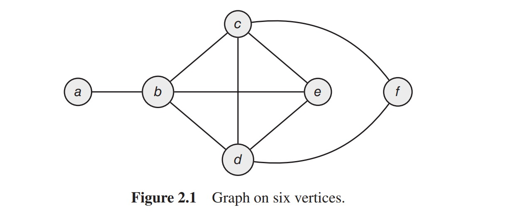
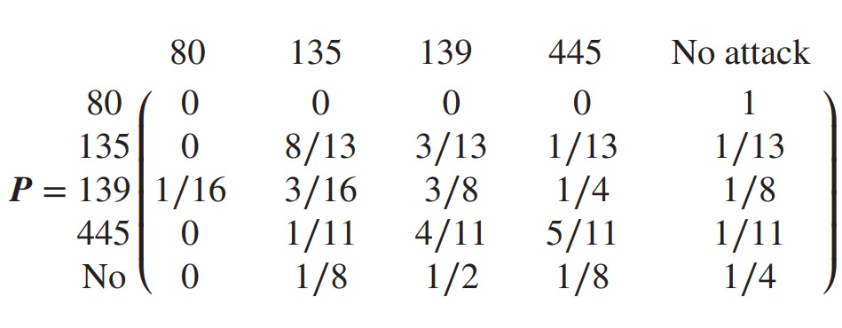

```{r setup, include=FALSE}
knitr::opts_chunk$set(echo = TRUE)
```

# 2.23

Simulate the first 20 letters (vowel/consonant) of the Pushkin poem Markov chain of Example 2.2



```{r}
# Define simulation function-根据初始状态的概率产生一个结果 ——> 用该结果对应转移概率， 在产生下一步结果 ——> 循环出结果 
simulation = function(initial_state,transition_matrix, steps, labels){
    if (missing(labels)) labels <- 1:length(initial_state)
    simulation_outcome = numeric(steps + 1)  
    simulation_outcome[1] = sample(x=1:length(initial_state), size = 1, prob = initial_state)
    for (i in 2:(steps+1)) {
      simulation_outcome[i] = sample(x=1:length(initial_state), size = 1, prob = transition_matrix[simulation_outcome[i-1],])
    }
    return(labels[simulation_outcome])
}
# Parameters
transition_matrix=matrix(c(0.175,0.526,0.825,0.474),nrow=2)
initial_state = c(0.5, 0.5)
labels = c("V", "C")
steps = 20

#开始模拟
simulation(initial_state, transition_matrix, steps, labels)

```

# 2.24

Simulate 50 steps of the random walk on the graph in Figure 2.1. Repeat the simulation 10 times. How many of your simulations end at vertex c? Compare
with the exact long-term probability the walk visits c


```{r}
# Parameters
transition_matrix=matrix(c(0,1/4,0,0,0,0,1,0,1/4,1/4,1/3,0,0,1/4,0,1/4,1/3,1/2,0,1/4,1/4,0,1/3,1/2,0,1/4,1/4,1/4,0,0,0,0,1/4,1/4,0,0),nrow=6)

initial_state = rep(1/6, 6)
labels = c("a","b","c","d","e","f")
steps = 50

#模拟，并重复10次模拟
A = replicate(10, simulation(initial_state, transition_matrix, steps, labels))

#计算长期进入C状态的概率
sum(A[steps+1,] == "c")/10

```

# 2.26
Transition Matrix:


Initial State: 

.jpeg)


1. Find out the joint distribution after 2 transitions
2. Figure out the long-term joint distribution

```{r}
# Define matrix power function 定义矩阵指数函数（不用for 循环）
matrixpower = function(matrix, n){
    if(n==0){return(diag(dim(matirx)[1]))}
    if(n==1){return(matrix)}
    if(n > 1){return(matrix %*% matrixpower(matrix, n-1))}
}

matrix = matrix(c(0, 0, 1/16, 0, 0, 0,8/13, 3/16, 1/11, 1/8, 0, 3/13, 3/8, 4/11, 1/2, 0, 1/13 ,1/4, 5/11, 1/8, 1, 1/13, 1/8 ,1/11 ,1/4), nrow = 5, ncol = 5)
initial_state = c(0, 0, 0, 0, 1)

## 1.
A=initial_state %*% matrixpower(matrix, 2)

## 2.
B=matrixpower(matrix, 100)

## 输出
print("ANSWER1")
print(A)
print("ANSWER2")
print(B)
```


# 2.27

```{r}
# gamblersruin.R
# Example 1.11

# gamble(k, n, p)
  #   k: Gambler's initial state
  #   n: Gambler plays until either $n or Ruin
  #   p: Probability of winning $1 at each play
  #   Function returns 1 if gambler is eventually ruined
  #                    returns 0 if gambler eventually wins $n
  
gamble <- function(k,n,p) {
	stake <- k
	while (stake > 0 & stake < n) {
		bet <- sample(c(-1,1),1,prob=c(1-p,p))
		stake <- stake + bet
	}
	if (stake == 0) return(1) else return(0)
	}   

k <- 2 
n <-  40  
p <- 1/2  
trials <- 1000
simlist <- replicate(trials, gamble(k, n, p))
mean(simlist) # Estimate of probability that gambler is ruined
# For p = 0.5, exact probability is (n-k)/n 
```


